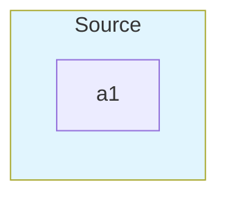
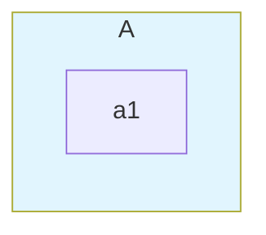
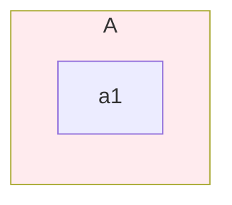

# Mermaid Style Routing Parity

This note captures Mermaid v11's observed behavior when a `style`, `class`,
or inline `:::` declaration targets an id that is also a subgraph, and how
mmdflux's style-map routing maps onto it. The scope here is **style routing
only**. The broader structural collision (mmdflux's IR keeping both
`nodes["A"]` and `subgraphs["A"]` for an explicit `A[NodeBox] … subgraph A`
input) affects edge resolution and SVG rendering, is **not** resolved, and is
tracked separately in #352.

The four inputs below were rendered with `mmdc` (Mermaid v11) and inspected
for the element that carries the resulting fill. They are reproducible with:

```bash
mmdc -i input.mmd -o input.svg -q
```

## Inputs and observed Mermaid output

### 1. Inline `:::` on a subgraph id



Mermaid emits `<g class="cluster blue" id="my-svg-A">` for the subgraph; the
distinctive fill `#e1f5fe` lands on the cluster's `<rect>`. No separate node
`A` appears under `<g class="nodes">`. The cluster carries the class.

mmdflux now matches: the inline class merges into `subgraph_styles["A"]`,
and the spurious implicit node created by edge-parsing for `A:::blue` is
pruned. The two maps stay independent.

### 2. `class` statement on a subgraph id


Output is identical to case 1: `<g class="cluster blue" id="my-svg-A">`.
Mermaid treats inline `A:::blue` and `class A blue` as the same routing.

mmdflux already routed `class A blue` to the subgraph via `merge_target_style`;
the inline path is now aligned with it.

### 3. Explicit node then subgraph with same id (`class` statement)



Mermaid emits `<g class="cluster blue" id="my-svg-A">`. There is no
coexisting node `A` under `<g class="nodes">` — Mermaid's unified id
namespace folds the prior `A[NodeBox]` into the subgraph cluster.

**mmdflux's style routing matches** (the class merges into the subgraph
style map; the node style map for id `A` stays unstyled), **but** the
structural collision is unresolved. mmdflux's IR keeps `nodes["A"]` alive
alongside `subgraphs["A"]`. Tracked in #352.

### 4. Explicit node then subgraph with same id (`style` statement)



Mermaid emits `<g class="cluster" id="my-svg-A">` with the cluster `<rect>`
carrying `fill:#ffebee !important`. Same conclusion as case 3: only the
cluster carries the style. mmdflux's style routing matches; the structural
collision is still tracked in #352.

## mmdflux style-routing rule

`compile_to_graph` collects subgraph ids in a first pass, then routes every
`style`, `class`, and inline `:::` declaration through `merge_target_style`:

- If the target id matches a known subgraph id → merge into
  `subgraph_styles`.
- Otherwise → merge into `node_styles`.

The MMDS `styleMap` and `subgraphStyleMap` stay independent: even when a
target id appears in both maps (because `A[NodeBox]` and `subgraph A` were
both declared), the subgraph map is the only one that receives the
class/style; the node map stays unstyled for that id.

## Unresolved: broader structural collision

The cases above pin **style-map routing only**. mmdflux's IR has separate
`nodes` and `subgraphs` maps, so when input declares both `A[NodeBox]` and
`subgraph A` mmdflux keeps both alive. Edge endpoint resolution, parent
assignment, layout positions, and SVG output all see the collision — for
example a `subgraph C` enclosing `A[NodeBox] --> B[NodeBox2]` after an
earlier `subgraph A` rewrites the edge from subgraph `A` via child `a1`
and stacks the explicit node `A` over the cluster. Mermaid's unified id
namespace does not reproduce that collision. The rule and fix are tracked
in #352.

The style-routing tests live in `src/diagrams/flowchart/compiler.rs`:

- `inline_triple_colon_class_on_subgraph_id_applies_to_subgraph`
- `explicit_node_with_same_id_as_subgraph_keeps_style_maps_independent`
